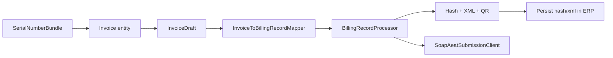

# Nowo integration guide

This bundle is designed as a **compliance layer** for existing billing/ERP systems — not a full invoicing module.

## Architecture



## Step-by-step integration

### 1. Install and configure

```bash
composer require nowo-tech/verifactu-bundle doctrine/orm doctrine/doctrine-bundle
```

```yaml
nowo_verifactu:
    issuer:
        nif: '%env(COMPANY_NIF)%'
        name: '%env(COMPANY_NAME)%'
    hash_chain:
        storage: doctrine
    aeat:
        environment: production
        certificate_path: '%env(AEAT_CERT_PATH)%'
        certificate_password: '%env(AEAT_CERT_PASSWORD)%'
```

### 2. Map your invoice to `InvoiceDraft`

```php
use Nowo\VerifactuBundle\Integration\InvoiceDraft;
use Nowo\VerifactuBundle\Integration\InvoiceToBillingRecordMapper;
use Nowo\VerifactuBundle\Model\RecordType;

$draft = new InvoiceDraft(
    issuerNif: $invoice->getCompany()->getNif(),
    invoiceSeriesNumber: $invoice->getNumber(),      // e.g. FAC-2026-00042
    issueDate: $invoice->getIssuedAt()->format('d-m-Y'),
    totalTaxAmount: $invoice->getTaxTotal()->format('0.00'),
    totalAmount: $invoice->getGrandTotal()->format('0.00'),
    generatedAt: (new \DateTimeImmutable())->format('c'),
    recordType: RecordType::Alta,
    invoiceType: 'F1',
    issuerName: $invoice->getCompany()->getLegalName(),
    operationDescription: $invoice->getDescription(),
);
```

Or inject the mapper service:

```php
$record = $this->mapper->map($draft);
$result = $this->processor->process($record, submitToAeat: true);
```

### 3. Persist results in your ERP

After `process()` succeeds:

| Field | Store in ERP |
|-------|----------------|
| `$result['record']->hash` | Veri*Factu fingerprint |
| `$result['record']->xml` | AEAT billing record XML |
| `$result['record']->signedXml` | XAdES XML (No-Veri*Factu) |
| `$result['submission']['reference']` | AEAT CSV reference |

### 4. Render QR on PDF invoices

```twig

<p>{{ verifactu_legend() }}</p>
```

### 5. Listen to events (audit, webhooks)

```php
use Nowo\VerifactuBundle\Event\VerifactuEvents;
use Nowo\VerifactuBundle\Event\AfterBillingRecordGeneratedEvent;

#[AsEventListener(event: VerifactuEvents::AFTER_BILLING_RECORD_GENERATED)]
public function onGenerated(AfterBillingRecordGeneratedEvent $event): void
{
    $record = $event->getRecord();
    // sync to ERP audit log, webhook, etc.
}
```

See `demo/symfony8/src/EventSubscriber/VerifactuAuditSubscriber.php` for a working example.

### 6. Invoice cancellation

```php
$draft = new InvoiceDraft(
    // ... same invoice identifiers ...
    recordType: RecordType::Anulacion,
);
$this->processor->process($this->mapper->map($draft), submitToAeat: true);
```

### 7. Optional bundles

| Bundle | Use case |
|--------|----------|
| `SerialNumberBundle` | Generate `invoiceSeriesNumber` before alta |
| `WordTemplateBundle` | PDF/Word invoice templates with QR |
| `SepaPaymentBundle` | SEPA collection referencing invoice number |

## Demo reference implementation

| File | Purpose |
|------|---------|
| `demo/symfony8/src/Model/Invoice.php` | Demo ERP invoice |
| `demo/symfony8/src/Service/InvoiceBillingService.php` | Bridge service |
| `demo/symfony8/src/EventSubscriber/VerifactuAuditSubscriber.php` | Event hook example |

Run: `make -C demo/symfony8 up` → http://localhost:8010

## Service IDs

| Service | ID |
|---------|-----|
| Processor | `nowo_verifactu.service.billing_record_processor` |
| Mapper | `nowo_verifactu.integration.invoice_to_billing_record_mapper` |
| Hash chain repo | `nowo_verifactu.hash_chain_repository` |
| AEAT client | `nowo_verifactu.aeat_submission_client` |
